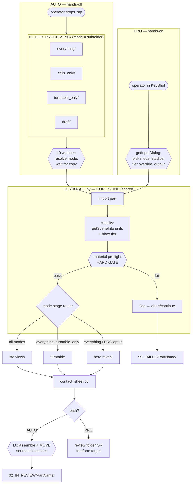
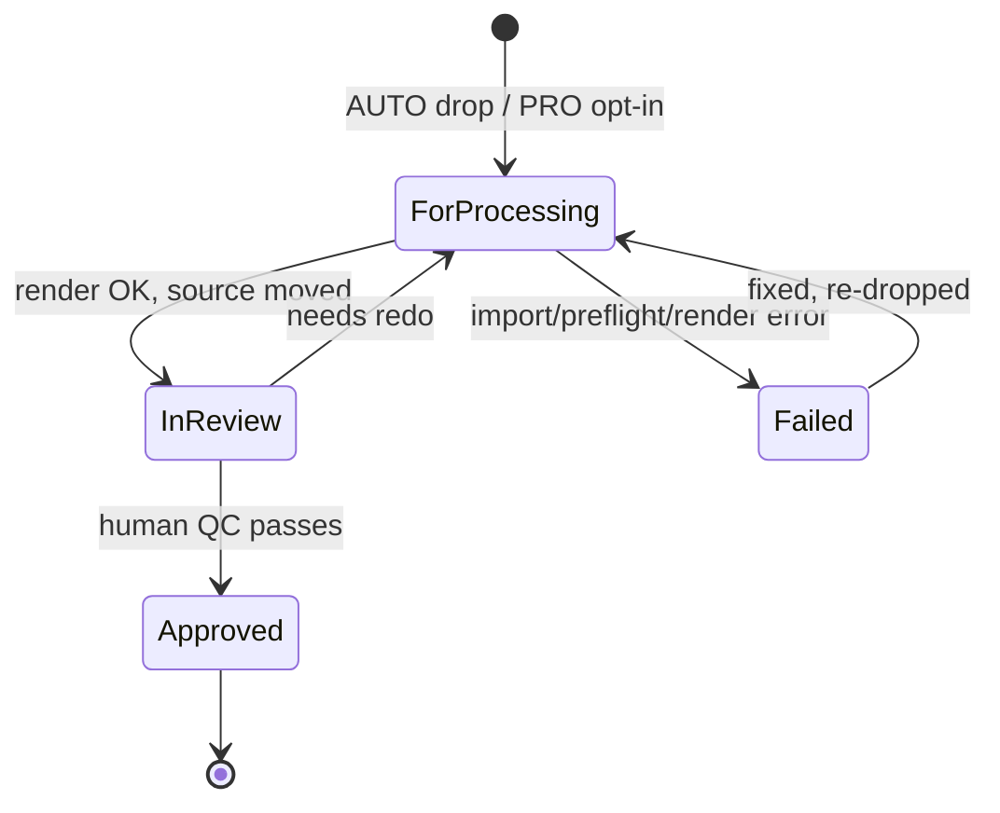

# KeyShot Render Pipeline — Architecture Guide

**UID:** RPA-7B2E4D
**Rev:** 3
**Date:** 2026-07-11
**Companion to:** RPR-3F9C1A Rev 2 (research/rationale — read that for the
*why*; this doc is the *how it wires together*).
**Rev 2 changes:** restructured around **two operator paths** — AUTO
(hands-off, drop-a-file) and PRO (hands-on, full control). Both share one
stage library; they differ only at the entry layer.
**Rev 3 changes:** added a third, low-priority EXPERT path (§10) — full
bypass, nothing enforced.
**Audience:** an agent already working inside this script library.

---

## 0. One-paragraph mental model

There is **one stage library** and **two front doors to it.**

- **AUTO** — the operator drops a CAD file into one folder and does nothing
  else. A watcher reads the mode from *which* folder, runs the right stages
  headless, and moves the file onward to review. Zero decisions.
- **PRO** — the operator opens KeyShot and drives the same stages by hand
  through their option dialogs: specific Studios, tuned reveal shots, single
  stages, tier overrides, custom output. Full control, for shots that need
  art direction.

The seam between them **already exists**: every script branches on
`lux.isHeadless()`. AUTO hits the headless branch; PRO hits the dialog branch.
Same code underneath — don't build two pipelines, build two entrances.

A third door — **EXPERT** — is noted in §10 as a low-priority future add: no
guardrails at all, everything exposed. Not part of the initial build.

---

## 1. The two paths

| | **AUTO (hands-off)** | **PRO (hands-on)** |
|---|---|---|
| Operator does | drops a file in a folder | opens KeyShot, runs a script, fills the dialog |
| Entry point | `watch.py` (L0) → `RUN_ALL.py` headless | `RUN_ALL.py` or any stage script, GUI dialog |
| Mode (what renders) | inferred from input subfolder | chosen explicitly in the dialog |
| Scale tier | auto from bbox, no prompt | auto-suggested, operator can override |
| Which stages | the folder's fixed preset | any subset, incl. single stage |
| Output location | fixed lifecycle folders | lifecycle folders **or** a freeform target |
| Complex art direction | not available (by design) | this is where it lives (tuned reveal, scatter, hand-staged one-offs — HANDOFF §5) |
| Failure handling | auto-routed to `99_FAILED/` | surfaced live in the console |
| Best for | volume, consistency, walk-away batches | hero shots, edge cases, experimentation |

**Rule of thumb for the operator:** if you want the same reliable set of
angles with no thinking, use AUTO. If you need to *decide* something about this
particular shot, use PRO. Both write to the same review structure, so a PRO
shot lands in the contact sheet next to AUTO ones.

---

## 2. Three orthogonal axes (both paths, do not collapse)

The two paths only change *who sets* each axis — the axes themselves are the
same:

| Axis | Question | AUTO sets it via | PRO sets it via |
|---|---|---|---|
| **Mode** | *what* renders | input subfolder name | dialog choice |
| **Scale tier** | *how* framed & sampled | auto (bbox) | auto + manual override |
| **Lifecycle state** | *where* the file lives | watcher moves it | operator (or opt-in to auto move) |

Mode × tier compose: a 2 mm part in `everything/` (or a PRO run with mode=full)
gets the full stage chain *and* Micro-tier framing. Mode picks stages; tier
tunes framing; they never contend.

---

## 3. Layering — what runs where

**The watch loop and file moves live OUTSIDE KeyShot.** KeyShot renders one
scene at a time and is a poor place for filesystem lifecycle work.

| Layer | Runs in | AUTO | PRO | Responsibility |
|---|---|:---:|:---:|---|
| **L0 — Watcher / orchestrator** | plain Python 3 | ✓ | — | poll inbox, resolve mode from folder, launch L1, do all moves, call contact sheet |
| **L1 — `RUN_ALL.py`** | KeyShot | headless | GUI dialog | import → classify tier → preflight gate → stage router. **No file moves.** |
| **L2 — stage scripts** | KeyShot | ✓ | ✓ | the existing render scripts as callable stage fns |
| **L3 — shared module** | imported | ✓ | ✓ | Studio resolution, manifest, framing+padding, units+bbox classify (currently duplicated across 4 scripts) |
| **L4 — `contact_sheet.py`** | plain Python 3 | ✓ | ✓ (opt) | runs after render, per part |

Layers **L1–L4 are shared by both paths.** AUTO adds L0 on top; PRO drives L1
directly. AUTO passes mode L0→L1 via a sidecar `job.json`/env vars read in the
headless branch (in place of hardcoded `DEFAULT_OPTIONS`); PRO reads the same
options from the `getInputDialog()` branch.

---

## 4. Flow — both doors into one spine



**CORE (both paths, unchangeable per run):** import → classify tier → preflight
gate → [stages] → contact sheet. Only the entry (folder vs dialog) and the exit
(auto-move vs operator-chosen) differ.

**Mode = the stage-router row only:**

| Mode | std views | turntable | hero reveal | fidelity |
|---|:---:|:---:|:---:|---|
| `everything/` | ✓ | ✓ | ✓ | full |
| `stills_only/` (your "noani") | ✓ | — | — | full |
| `turntable_only/` | — | ✓ | — | full |
| `draft/` | ✓ | — | — | preview |
| *PRO: any subset* | ○ | ○ | ○ | operator |

---

## 5. Lifecycle state machine (AUTO drives it; PRO may opt in)

The part's **folder location is its state.** AUTO moves it automatically; a PRO
run can either write into this same structure or to a freeform folder.



L0 mover rules (AUTO):
- **Move source only after outputs are confirmed on disk** — never
  move-then-render, a crash would lose the source with nothing to show.
- **Failure keeps the source safe:** route to `99_FAILED/PartName/` with the
  log before deleting from inbox.
- **Guard partial copies:** wait for file size to stabilize across two polls
  (or require a `.ready` sentinel) before touching a freshly-dropped file.

---

## 6. Filesystem structure (correlated to scripts)

```
KEYSHOT_PIPELINE/
│
├── 00_MASTER/
│   ├── master_template.bip          # studios, cameras, lighting, mat templates
│   └── assets/                      # reveal/scatter source geometry (PRO)
│
├── 01_FOR_PROCESSING/               # ← AUTO: the only place the operator touches
│   ├── everything/                  #   mode = subfolder name
│   ├── stills_only/
│   ├── turntable_only/
│   └── draft/
│
├── 02_IN_REVIEW/                    # both paths land here (PRO optionally)
│   └── <PartName>/
│       ├── source/<PartName>.stp
│       ├── stills/  turntable/  reveal/
│       ├── contact_sheet.html
│       └── render_manifest.csv
│
├── 03_APPROVED/<PartName>/
├── 99_FAILED/<PartName>/            # source + error_log.txt
│
├── _PRO_OUT/                        # PRO freeform output target (optional)
│
├── scripts/
│   ├── watch.py                     # L0 — AUTO orchestrator (plain python)
│   ├── RUN_ALL.py                   # L1 — shared launcher (headless=AUTO, dialog=PRO)
│   ├── stages/                      # L2 — existing scripts as stage fns
│   │   ├── 1_BATCH_MAT_PREFLIGHT.py
│   │   ├── 2_BATCH_STD_VIEW_AQ.py
│   │   ├── 2_BATCH_TURNTABLE_AQ.py
│   │   ├── 2ANI_REVEALANIMATION_AQ.py
│   │   └── 2ANI_SCATTERANIMATION_AQ.py   # PRO-oriented
│   ├── shared/                      # L3 — de-duplicated helpers
│   │   ├── studios.py  manifest.py
│   │   ├── framing.py               #   centerAndFit + PADDING_FACTOR + tier
│   │   └── classify.py              #   getSceneInfo units + bbox tier
│   └── contact_sheet.py             # L4 — standalone
│
└── logs/pipeline_master.csv         # append-only, all jobs, both paths
```

### Stage → script → I/O

| CORE stage | Script | Reads | Writes |
|---|---|---|---|
| classify | `shared/classify.py` (new) | `getSceneInfo()`, `getBoundingBox(world=True)` | tier → job context |
| preflight (gate) | `1_BATCH_MAT_PREFLIGHT.py` | part + material template | `material_preflight_report.csv` |
| std views | `2_BATCH_STD_VIEW_AQ.py` | part + Studios | `stills/*.png` |
| turntable | `2_BATCH_TURNTABLE_AQ.py` | part + base Studio/cam | `turntable/*.mp4` |
| hero reveal | `2ANI_REVEALANIMATION_AQ.py` | part + Model Set anim | `reveal/*.mp4` |
| contact sheet | `contact_sheet.py` | the part's output folder | `contact_sheet.html` |

The existing `N_` filename prefixes (`0_`=material setup, `1_`=preflight,
`2_`=render, `2ANI_`=animation, `3_`=report) already **are** a stage-order
convention. `RUN_ALL.py` chains in prefix order for both paths — keep it.

---

## 7. Path design notes

**AUTO — the hot-folder pattern.** Adopt it, with the three §5 guardrails
(watcher outside KeyShot, move-on-success-only, partial-copy guard). Two locks:
- **Mode via subfolder, not filename** — filenames stay clean PartNames; the
  whole lifecycle keys on basename (manifest, output folders, contact-sheet
  grouping). Don't overload the filename with mode tokens.
- **Keep mode (input subfolder) and state (top-level folder) on separate
  axes** — one folder never means both "stills-only" and "in review".

**PRO — the dialog path.** This is the home for everything AUTO deliberately
omits: specific Studio/camera targeting, tuned reveal moves (zoom/crane/env
options already in `2ANI_REVEALANIMATION_AQ.py`), scatter, tier overrides,
single-stage runs, and the not-yet-built hand-staged one-off script
(HANDOFF §5: particles, rain). PRO reuses L1–L4 unchanged; it just exposes the
full option surface instead of a fixed preset. A PRO run *may* opt into the
review lifecycle (writes to `02_IN_REVIEW/`) or target `_PRO_OUT/` freeform.

**Shared discipline.** Because both paths ride the same spine, the hard QC gate
and contact sheet apply to PRO too — a hands-on shot still can't skip preflight
and still generates a contact sheet. Consistency doesn't depend on which door
was used.

---

## 8. Workload guidelines (operator-facing)

- **Naming is load-bearing.** `<PartName>.stp` → PartName (basename, no spaces;
  sanitize on ingest) is the key for every output, folder, and manifest row.
  Enforce a sanitize step at ingest (L0 for AUTO, dialog validation for PRO).
- **Triage cheap, promote winners (AUTO).** Bulk-drop into `draft/` for a fast
  low-fi pass; move keepers into `everything/`. Escalate to PRO only for the
  handful of shots that need art direction.
- **Batching is serial.** KeyShot headless renders one scene at a time; N files
  in a folder process in sequence. `draft/` clears fast, `everything/` is the
  slow lane.
- **Re-processing is a move.** Source leaves the inbox on success, so redoing a
  part = drag its `.stp` from `02_IN_REVIEW/PartName/source/` (or `99_FAILED/`)
  back into a processing folder.
- **Don't hand-edit `02_/03_` internals.** Review + contact-sheet UX depend on
  that layout; treat it as pipeline-owned.
- **Failures are visible.** AUTO routes to `99_FAILED/` with an
  `error_log.txt`; PRO surfaces them live in the KeyShot console.

---

## 9. Build order for the implementing agent

1. **Extract `shared/` (L3) first** — de-duplicate Studio resolution, manifest
   logging, framing/padding, classify out of the 4 scripts that copy it.
   Unblocks both paths.
2. **`RUN_ALL.py` (L1)** — CORE spine (import → classify → preflight gate →
   stage router → contact sheet). Both branches: headless reads
   `job.json`/env (AUTO), dialog exposes the full option surface (PRO). No
   file moves in either.
3. **`watch.py` (L0)** — AUTO only: poll `01_FOR_PROCESSING/*/`, resolve mode,
   launch L1, do §5 lifecycle moves, call `contact_sheet.py`, append
   `logs/pipeline_master.csv`.
4. **Tier overrides** — wire RPR-3F9C1A §5b classification into framing once
   real bbox breakpoints are calibrated (applies to both paths).
5. **PRO extras** — expose tier override + single-stage selection in the
   dialog; later, the hand-staged one-off script (HANDOFF §5).

### Still open (from RPR-3F9C1A, unchanged)
- Real bbox tier breakpoints (calibration pass over actual parts).
- Input file formats (STEP/IGES auto-detect units; STL/OBJ don't).
- Final mode/preset list.

---

## 10. EXPERT path — "good luck, you're on your own" (LOW PRIORITY)

A third door, below PRO, for the operator who wants to break the rules
deliberately. Explicitly **not** part of the initial build — noted here so the
architecture leaves room for it and nobody designs it out.

Where PRO exposes the full *option surface* but still rides the CORE spine
(preflight gate stays on, contact sheet always fires, stage order fixed),
EXPERT drops the spine's guarantees too:

- **Skip any stage, including the hard QC gate.** Preflight becomes optional.
- **Reorder / run stages standalone**, out of the `N_` prefix sequence.
- **Raw option access** — edit the options dict / job file directly, past what
  the dialog validates (arbitrary samples, camera math, tier values, padding).
- **No lifecycle, no manifest enforced** — output wherever; logging optional.
- **Bypass the classifier** — hand-set tier/units, or turn detection off.

Design guidance so this stays cheap to add later and safe to leave out:
- Implement as a **flag on the existing spine, not a fork.** e.g. an
  `enforce=False` / `expert=True` mode on `RUN_ALL.py` that turns each guard
  (gate, ordering, lifecycle, logging) into a no-op. The stages don't change;
  only the enforcement wrapper relaxes. This keeps EXPERT from becoming a
  fourth copy of the pipeline to maintain.
- **Loud, not silent.** When guards are off, banner it in the console
  ("EXPERT MODE — preflight skipped, no manifest") so a skipped gate is a
  visible choice, never an accident.
- **Never the default, never reachable from AUTO.** EXPERT is opt-in from PRO
  only; the drop-a-file path can't land here.
- Outputs may still *optionally* target `_PRO_OUT/` or the review structure,
  but nothing requires it.

Priority: low. AUTO + PRO cover the real workload; EXPERT is a release valve
for one-off experiments and debugging, worth building only once the first two
paths are solid.
